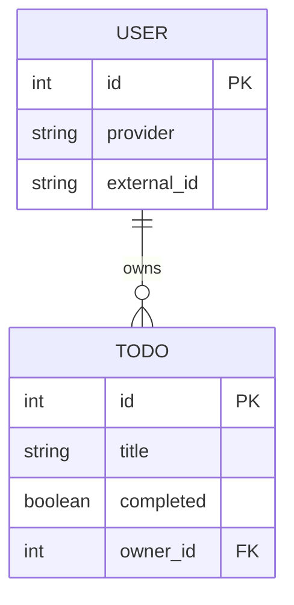
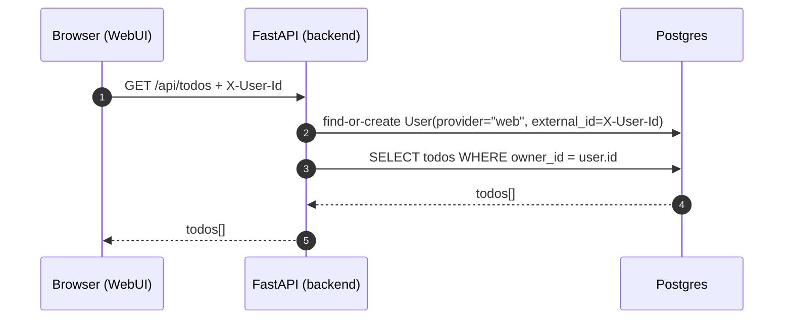
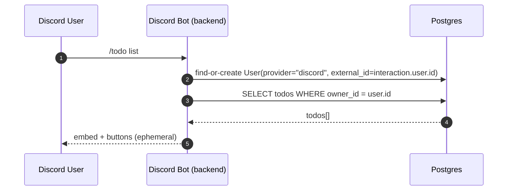

# Discord Bot – Skeleton

Et lille undervisningsprojekt til et 3‑ugers valgfag om deployment:

- **Python backend** med FastAPI
- **Discord‑bot** med `discord.py`
- **Postgres** via Docker Compose
- Simpel **web‑UI** i ren HTML/CSS/JS

Backend fungerer både som **API** og som **Discord‑bot**, og begge dele arbejder mod den samme Postgres‑database.

### Forudsætninger

- Docker + Docker Compose installeret
- En Discord‑konto

### Guide: Discord Developer Portal (DDP)

Før botten kan køre, skal den oprettes i **Discord Developer Portal** og du skal have en **bot token** samt invitere botten til en server.

1. **Åbn Developer Portal**
   - Gå til [https://discord.com/developers/applications](https://discord.com/developers/applications)
   - Log ind med din Discord‑konto

2. **Opret en ny applikation**
   - Klik **"New Application"**
   - Giv den et navn (fx "DoD Todo Bot") og bekræft

3. **Tilføj en Bot til applikationen**
   - I venstremenuen: **Bot** → **Add Bot**
   - Du kan ændre bottenavn/avatar under **Bot** hvis du vil

4. **Hent bot token**
   - Under **Bot** → **Token**: klik **Reset Token** eller **View Token**
   - **Kopier token** og gem den et sikkert sted – den vises kun én gang
   - Del **aldrig** token med andre og commit den ikke til git. Sæt token i filen `.env` (se nedenfor); `.env` er ikke med i git.

5. **Slå nødvendige Privileged Gateway Intents til**
   - Under **Bot** → **Privileged Gateway Intents**:
     - **Message Content Intent** → slå **ON** (så botten kan læse kommandoer som `!ping` og `!todo_add`)
   - Gem med **Save Changes**

6. **Inviter botten til en server**
   - I venstremenuen: **OAuth2** → **URL Generator**
   - Under **SCOPES**: vælg **bot**
   - Under **BOT PERMISSIONS**: vælg fx **Send Messages**, **Read Message History**, **Read Messages/View Channels** (evt. **Use Slash Commands** hvis I tilføjer slash commands senere)
   - Kopier den genererede **URL** nederst, åbn den i browseren og vælg den server, botten skal ind i

Efter dette har du en **token** (til `DISCORD_BOT_TOKEN`) og botten er med i den valgte server.

### Konfiguration (`.env`)

Projektet bruger en **`.env`** fil til hemmeligheder og miljøvariabler. Docker Compose læser den automatisk.

- **`.env.example`** – skabelon med pladsholdere (denne fil ligger i repoet).
- **`.env`** – din lokale konfiguration; opret den ud fra `.env.example` og udfyld fx `DISCORD_BOT_TOKEN`. `.env` bør **ikke** committes til git (sørg for at den står i `.gitignore`).

Variabler i `.env` bruges af både `db`- og `backend`-containeren (Postgres-bruger/kodeord og database-URL læses derfra).

### Kom hurtigt i gang

1. Gå til mappen:
   ```bash
   cd Discord
   ```
2. Opret din lokale `.env` ud fra skabelonen og sæt din bot token (fra DDP-guiden ovenfor):
   ```bash
   cp .env.example .env
   ```
   Åbn `.env` og erstat `DIN_DISCORD_BOT_TOKEN_HER` (eller `CHANGE_ME`) med din rigtige token. Du kan evt. også ændre `POSTGRES_USER` / `POSTGRES_PASSWORD` / `POSTGRES_DB`; `docker-compose` læser alle værdier fra `.env`. **Commit aldrig `.env`** – den indeholder hemmeligheder.
3. Byg og start:
   ```bash
   docker compose up --build
   ```
4. Åbn web‑UI:
   - Gå til `http://localhost:8000/`
   - Tryk på knappen for at teste `/api/health`
5. Inviter botten til en server og test i en tekstkanal:
   - Skriv `!ping` → botten svarer `Pong!`

### Arkitektur (kort)

- **Service `db`**: Postgres 16 container
- **Service `backend`**:
  - Kører FastAPI på port `8000`
  - Starter Discord‑botten i samme proces
  - Taler med Postgres via en ORM

### Brugersystem (vigtigt)

Vi har et **simpelt brugersystem**, så hver bruger får sin egen todo‑liste.

- **Discord**: brugerens id kommer fra `interaction.user.id` (Discord user id).
- **WebUI (midlertidigt)**: klienten sender en header `X-User-Id` (valgfri streng), som bruges til at identificere brugeren. Senere kan vi skifte til rigtig auth (OAuth/JWT) og stadig genbruge `User`‑tabellen.

Det betyder:

- `/api/todos` viser **kun** todos for den aktuelle bruger.
- Discord `/todo ...` viser **kun** dine egne todos.

#### Mermaid: Datamodel (ERD)



#### Mermaid: Request-flow (WebUI)



#### Mermaid: Request-flow (Discord)



### CRUD‑ressource: Todo

Som eksempel arbejder vi med en simpel **Todo**‑model:

- **Felter**:
  - `id`: unikt id
  - `title`: kort beskrivelse
  - `completed`: om todo’en er færdig

Der findes **fuld CRUD** både via HTTP‑API’et og via Discord‑commands.

#### API‑endpoints (HTTP)

- **GET `/api/todos`**
  - Kræver header: `X-User-Id: <dit-id>`
  - Retur: liste af todos (kun for den bruger)

- **POST `/api/todos`**
  - Kræver header: `X-User-Id: <dit-id>`
  - Body (JSON):
    ```json
    { "title": "Lær Docker", "completed": false }
    ```
  - Retur: oprettet todo med `id`

- **GET `/api/todos/{todo_id}`**
  - Kræver header: `X-User-Id: <dit-id>`
  - Retur: én todo (kun hvis den tilhører brugeren) eller 404

- **PUT `/api/todos/{todo_id}`**
  - Kræver header: `X-User-Id: <dit-id>`
  - Body (JSON), samme form som ved POST
  - Retur: opdateret todo

- **DELETE `/api/todos/{todo_id}`**
  - Kræver header: `X-User-Id: <dit-id>`
  - Sletter todo’en, retur en lille status‑payload

#### Discord‑commands (CRUD)

Eksempel‑kommandoer (prefiks `!`):

- **Opret todo**
  - `!todo_add Lær Docker`
  - Opretter en ny todo med `title="Lær Docker"` og svarer med dens id.

- **List todos**
  - `!todo_list`
  - Viser en simpel liste med id, titel og status.

- **Vis én todo**
  - `!todo_get 1`

- **Opdater todo (toggle completed)**
  - `!todo_toggle 1`

- **Slet todo**
  - `!todo_delete 1`

Alle Discord‑commands bruger det samme CRUD‑lag som API’et, så eleverne kan se genbrug af forretningslogik.

#### Discord (interaktivt)

Vi anbefaler at bruge slash commands, fordi de er mere brugervenlige og ikke kræver at man husker syntax:

- `/todo list` (embed + knapper: Opdater, Tilføj, Toggle, Slet)
- `/todo add title:...`
- `/todo toggle todo_id:...`
- `/todo delete todo_id:...`

### Forslag til øvelser

- **Niveau 1**
  - Tilføj flere felter til Todo (f.eks. `created_at`, `due_date`)
  - Udvid web‑UI til at vise liste af todos og oprette nye via fetch mod API’et

- **Niveau 2**
  - Tilføj validering (titellængde, tomme strenge osv.)
  - Tilføj logging af alle Discord‑commands til databasen

- **Niveau 3**
  - Tilføj rollestyring i Discord (kun brugere med en bestemt rolle må slette todos)
  - Tilføj simple metrics (antal todos, antal completed) og lav et `/api/stats` endpoint
